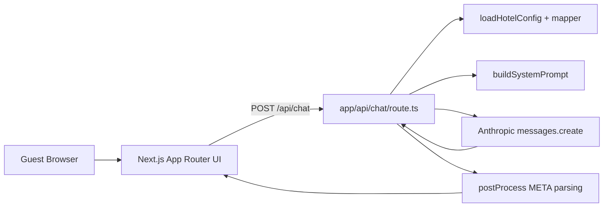
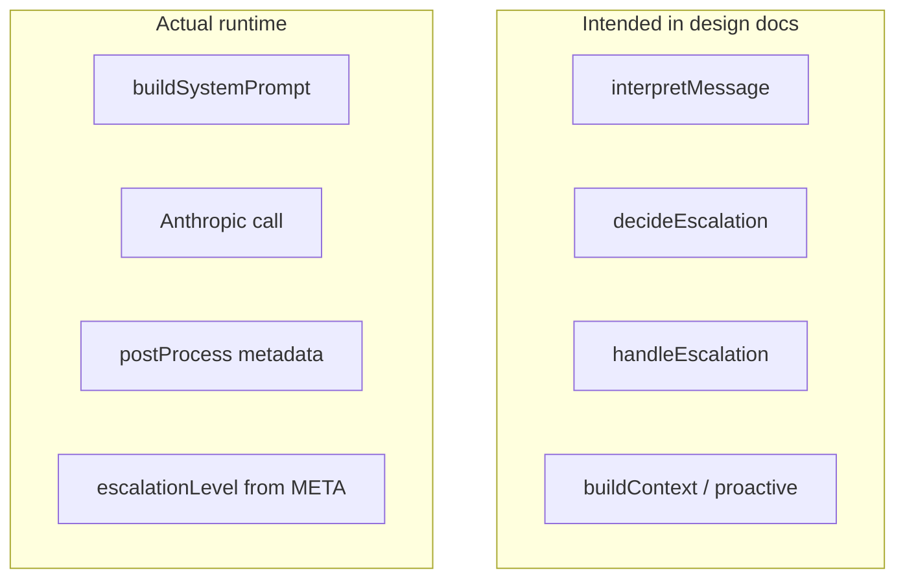
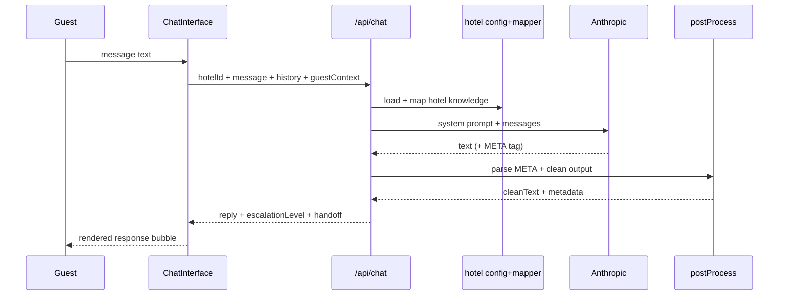
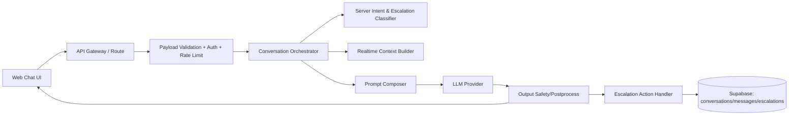

# Hotel AI Prototype — Full Code Review, Architecture Analysis, and Prioritized Bug Report

**Date:** 2026-04-02  
**Reviewer:** GPT-5.3-Codex  
**Scope:** Entire repository (application, AI orchestration, data model, build/runtime posture)

---

## 1) Executive Summary

The project has a strong foundational split between hotel knowledge, prompting, and UI flow, but there is a meaningful **architecture drift** between the approved design and the implementation currently running in production paths. The largest risks are:

1. **Escalation and intent are model-self-reported metadata, not server-verified logic** (safety and reliability risk).
2. **The chat endpoint is unauthenticated and unthrottled** (cost abuse / availability risk).
3. **Input and output controls are weak** (prompt bloat, failure-mode leakage, inconsistent behavior).
4. **Several modules exist but are not wired into runtime flow** (maintenance and correctness risk).

Overall maturity: **Prototype+** (strong concept and structure, not yet production-safe).

---

## 2) Review Methodology

- Static architecture review across `app/`, `lib/`, `supabase/`, and `docs/`.
- Contract and boundary analysis (UI ⇄ API, API ⇄ AI provider, domain mapping).
- Security, resilience, and maintainability review.
- Build/type checks to validate operational baseline.

Checks run:
- `npx tsc --noEmit` ✅
- `npm run build` ⚠️ (blocked by Google Fonts fetch in this environment)

---

## 3) Full Architecture Documentation

## 3.1 Current Runtime Topology (As Implemented)



### Observations
- The request path is simple and coherent for a prototype.
- The orchestration is centered inside one API route.
- Response control depends on prompt discipline + post-processing metadata parsing.

---

## 3.2 Intended vs Actual AI Decision Pipeline



### Gap
Large parts of the intended safety and decision stack are implemented as modules but not used in the active `/api/chat` flow.

---

## 3.3 Layer-by-Layer Documentation

### Presentation Layer
- Route: `/hotel/[hotelId]` with a phase-based guest journey and chat entry point.
- Chat interface sends `hotelId`, message, history, and optional guest context to `/api/chat`.
- UX supports escalation styling and handoff banners when escalation level is high.

### API Layer
- Single endpoint handles parse, config load, prompt creation, model call, post-process, and response payload.
- HTTP error handling exists for invalid JSON, unknown hotel, provider failure, and empty response.

### Domain / Knowledge Layer
- Typed hotel schema exists and is expressive (facilities, dining, services, escalation policies, local tips, FAQs).
- Mapper transforms hotel config into prompt-consumable hotel knowledge.
- Registry currently supports one active hotel (`grand-hotel`).

### AI / Orchestration Layer
- Two prompt-builders exist (`lib/system-prompt.ts` and `lib/ai/prompt-builder.ts`) with overlapping concerns.
- Runtime uses `lib/system-prompt.ts` only.
- Post-processing relies on regex extraction of `[META: ...]` tags emitted by the model.

### Data Layer
- Supabase clients are configured (server + browser).
- A comprehensive initial SQL schema exists with strong privacy/compliance orientation.
- Runtime app currently does not persist chats, escalations, or analytics to that schema.

---

## 4) Prioritized Bug & Risk Report (Critical → Minor)

## Critical

### C1 — Safety-critical escalation is model-self-declared, not server-verified
**Evidence:** Escalation level is derived from model-emitted metadata in response text, then mapped directly to numeric levels.  
**Impact downstream:** Missed emergencies, false negatives on handoff, inconsistent complaint handling, compliance and duty-of-care risk.  
**Why critical:** Emergency/human handoff behavior should never rely solely on untrusted model self-labeling.  
**Recommendation:** Run deterministic server-side classification (`interpretMessage` + guardrails), then treat model metadata as advisory only.

### C2 — `/api/chat` lacks authentication and rate limiting
**Evidence:** Public route accepts arbitrary payload and calls external LLM provider.  
**Impact downstream:** Token/cost abuse, denial-of-wallet, service degradation, noisy logs, poor SLO.  
**Recommendation:** Add auth (session/API key), per-IP + per-account rate limits, request size caps, and abuse monitoring.

---

## High

### H1 — Architecture drift: implemented decision modules are not wired into runtime
**Evidence:** `lib/ai/interpreter.ts`, `lib/ai/escalation.ts`, `lib/ai/escalationHandler.ts`, and context/proactive modules exist but are not used in the API request pipeline.  
**Impact downstream:** Dead-code confusion, onboarding friction, untested critical logic, divergence between docs and behavior.  
**Recommendation:** Either (a) wire modules into live path now, or (b) remove/flag as future with explicit feature flags.

### H2 — Unbounded/weak input validation on chat payload
**Evidence:** `message`, `history`, and guest context are not schema-validated for length, shape, or role constraints beyond minimal presence checks.  
**Impact downstream:** Prompt overflow, increased latency/cost, unstable outputs, easy abuse.
**Recommendation:** Enforce schema with zod/valibot, max history length, message byte/token ceilings, normalized role enum.

### H3 — Upstream error detail leaks in API response
**Evidence:** Anthropic error message detail is returned to client (`detail`) for failures.  
**Impact downstream:** Internal diagnostics leakage, provider error fingerprinting, possible secret-adjacent exposure in edge cases.  
**Recommendation:** Log full detail server-side only; return generic client error codes/messages.

### H4 — Build reliability depends on live Google Fonts fetch
**Evidence:** Build fails in restricted/offline environments when fetching Geist fonts.  
**Impact downstream:** CI fragility, blocked releases in constrained infra.  
**Recommendation:** Self-host fonts or provide robust fallback strategy for deterministic builds.

---

## Medium

### M1 — Domain mapping hardcodes policy-like values that may conflict with source config
**Evidence:** Mapper injects fixed values (e.g., valet pricing, payment methods, check-in/out process snippets) independent of hotel source-of-truth fields.  
**Impact downstream:** Policy inconsistency and potential guest misinformation.  
**Recommendation:** Treat hotel config as canonical; avoid adding constants unless explicitly versioned defaults.

### M2 — Duplicate prompt architecture increases drift risk
**Evidence:** Two prompt generation modules with similar responsibilities and style guides.  
**Impact downstream:** Inconsistent outputs, unclear ownership, test blind spots.  
**Recommendation:** Consolidate to one prompt engine with composable sections.

### M3 — Basic language/intent heuristics are simplistic when/if enabled
**Evidence:** Keyword matching and binary German detection can misclassify mixed language or nuanced complaints.  
**Impact downstream:** Wrong tone/language/escalation in future wired flow.  
**Recommendation:** Add robust language detection and fallback confidence logic.

### M4 — Data model and runtime implementation are disconnected
**Evidence:** Rich Supabase schema exists but runtime does not persist conversations/escalations/events.  
**Impact downstream:** No audit trail, no analytics feedback loop, weaker product learning.
**Recommendation:** Implement minimal persistence slice first (conversation + messages + escalation events).

---

## Minor

### m1 — README is still default Next.js scaffold
**Impact downstream:** Slower onboarding and ambiguous runbook expectations.  
**Recommendation:** Replace with project-specific setup, architecture, env vars, and troubleshooting.

### m2 — Locale/date content in UI is hardcoded for one timeline/language
**Impact downstream:** UX inconsistency for multi-language/multi-date demos.  
**Recommendation:** Move to locale-aware formatting and data-driven timeline labels.

### m3 — Test strategy is minimal and not integrated in scripts
**Impact downstream:** Regressions can ship unnoticed.  
**Recommendation:** Add `test` script and CI checks for critical flows (route contract + escalation behavior).

---

## 5) Architecture Visualizations

## 5.1 Component Map

```mermaid
flowchart TB
  subgraph Frontend
    P1[app/page.tsx redirect]
    P2[app/hotel/[hotelId]/page.tsx]
    P3[GuestJourney]
    P4[ChatInterface]
  end

  subgraph Backend
    B1[/api/chat route]
    B2[knowledge-base loader]
    B3[mapper to HotelKnowledge]
    B4[system prompt builder]
    B5[Anthropic SDK]
    B6[post-processor]
  end

  subgraph DataAndConfig
    D1[lib/hotels registry]
    D2[grand-hotel config]
    D3[Supabase clients]
    D4[SQL schema migration]
  end

  P1 --> P2 --> P3 --> P4 --> B1
  B1 --> B2 --> D1 --> D2
  B1 --> B3 --> B4 --> B5 --> B6 --> P4
  B1 -.not used in runtime path.- D3
  D4 -.prepared but mostly idle.- B1
```

## 5.2 Request Sequence



---

## 6) Improvement Suggestions (Prioritized Implementation Plan)

## Phase 1 — Safety and abuse controls (immediate)
1. Add auth + rate limiting on `/api/chat`.
2. Enforce strict payload schema and token ceilings.
3. Move escalation intent decisions server-side (deterministic baseline).
4. Remove provider error details from client responses.

## Phase 2 — Architecture convergence
1. Wire `interpreter`, `decideEscalation`, and `handleEscalation` into route.
2. Integrate `buildContext` and optional proactive messaging path.
3. Consolidate prompt generation into single module + tests.
4. Define one source-of-truth for escalation states.

## Phase 3 — Persistence and observability
1. Persist conversations/messages/escalation events to Supabase.
2. Add structured logging with trace IDs.
3. Add dashboards for escalation distribution, latency, token cost.
4. Add replay-safe audit events for high-severity interactions.

## Phase 4 — Product hardening
1. Replace hardcoded timeline strings with i18n/date locale.
2. Update README and operational runbook.
3. Add CI pipeline for typecheck, unit tests, route tests, build fallback.
4. Add chaos and failure-mode tests (provider timeout, empty model response, malformed metadata).

---

## 7) Target Architecture (Recommended)



**Design intent:** deterministic safety-critical decisions on the server, with model output used for language quality and knowledge-grounded response generation.

---

## 8) Final Assessment

This codebase is a solid prototype foundation with strong conceptual components already present. The next high-value move is **not** feature expansion; it is **pipeline convergence + safety hardening** so the architecture behaves as documented and can safely scale from demo to production pilot.
